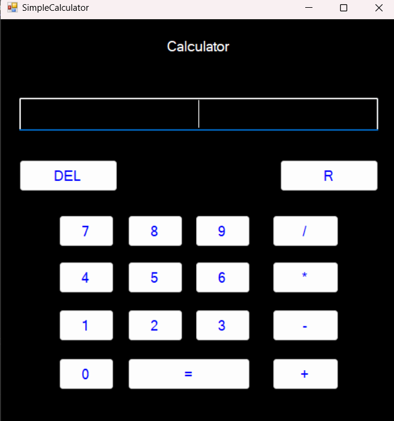
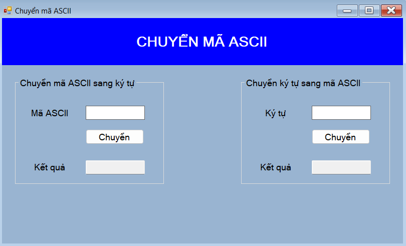
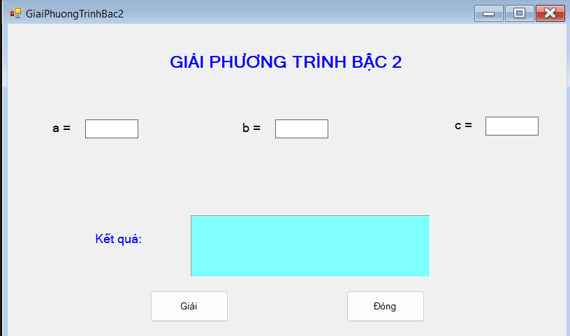
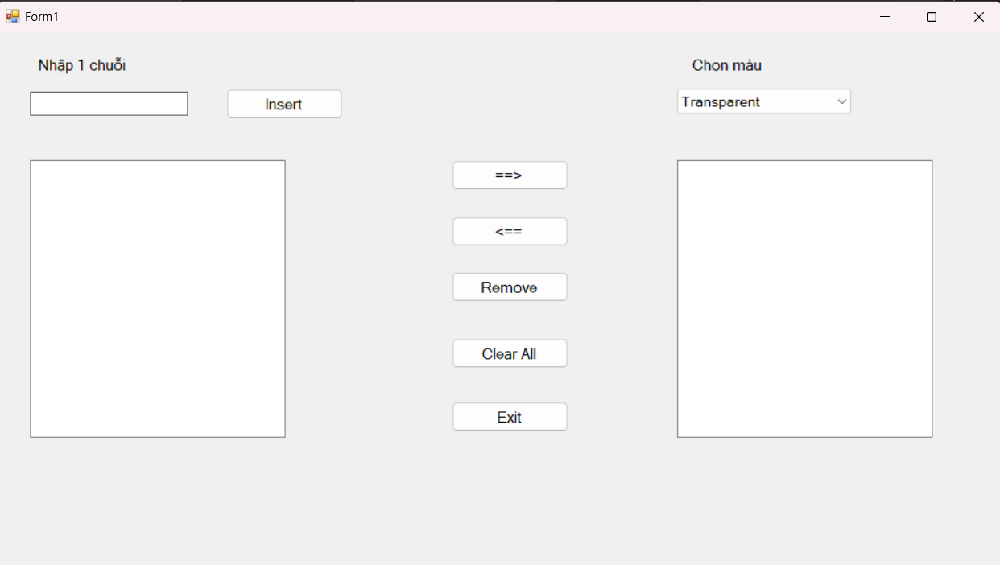

# LTGD

# Bài chương 1(chưa làm)

# Bài chương 2:
  ## Simple Calculator: 
  
  

  ## Chuyển mã ascii
  
  

  ## Giải phương trình bậc 2

  

  ## Random number

  

# Chương 3

## Random Fraction

# Chương 4:

  ## ComboListBox

  

