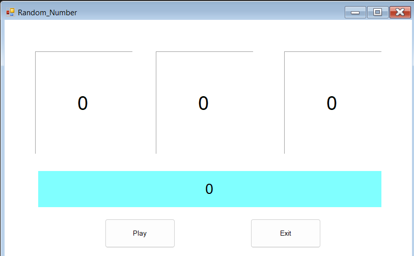
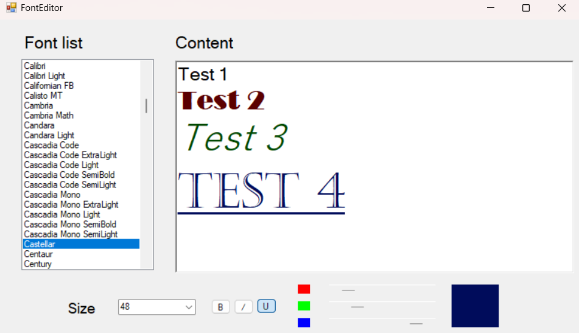
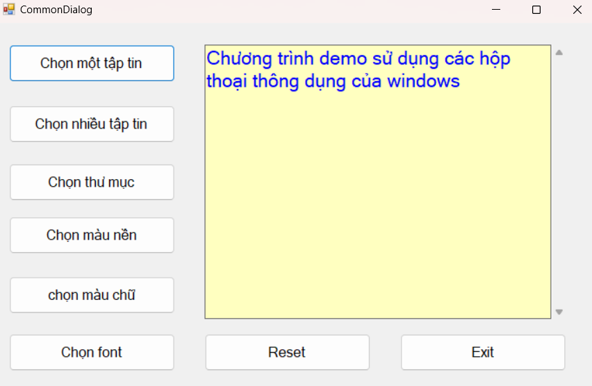
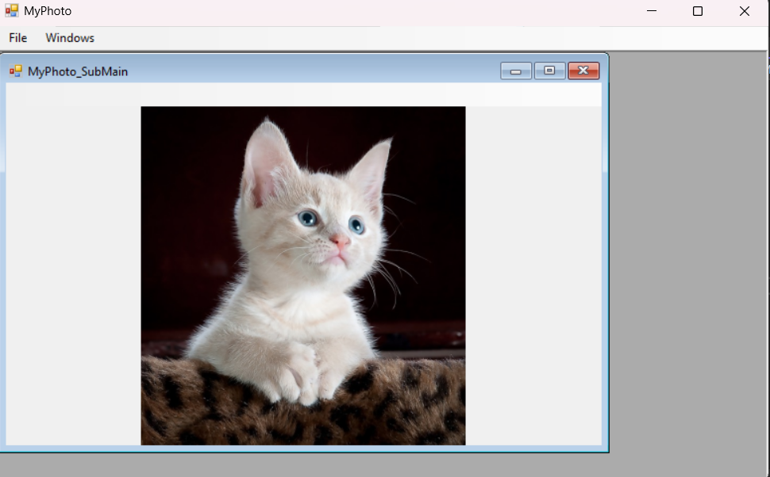
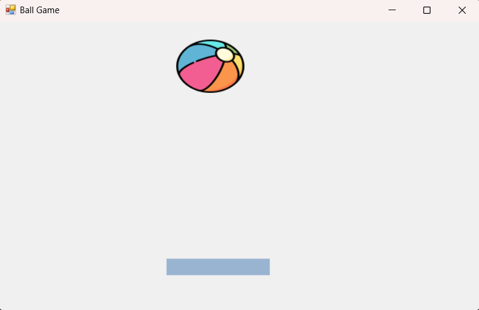
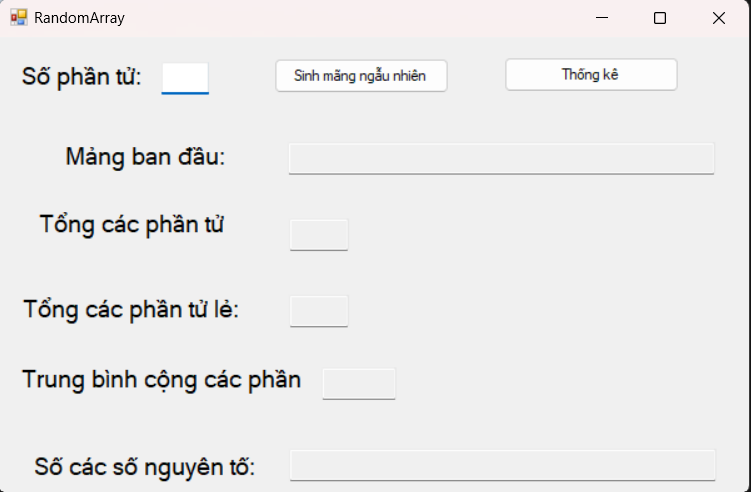

# LTGD(BT thêm)

### Mục lục

[Chương1](#bài-chương-1)

[Chương2](#bài-chương-2)
- [1.Simple Calculator](#simple-calculator)
- [2.ASCII Transform](#chuyển-mã-ascii)
- [3.Pt bậc 2](#giải-phương-trình-bậc-2)
- [4.Random Number](#random-number)
    
[Chương3](#bài-chương-3)
- [1.Random Fraction](#random-fraction)

[Chương4](#bài-chương-4)
- [1.ComboListBox](#combolistbox)
- [2.FontEditor](#fonteditor)
- [3.CommonDialog](#commondialog)
- [4.MyPhoto](#myphoto)

[Chương5](#bài-chương-5)
- [BallGame](#ball-game)

[Chuong6](#bài-chương-6)
- [1.RandomArray](#random-array)

# Bài chương 1

# Bài chương 2:
  ## Simple Calculator: 
  
  

  ## Chuyển mã ascii
  
  

  ## Giải phương trình bậc 2

  

  ## Random number

  

# Bài chương 3

## Random Fraction

# Bài chương 4:

  ## ComboListBox

  

  ## FontEditor

  
  
  ## CommonDialog
  

  ## MyPhoto
  

# Bài chương 5:

  ## Ball Game
  

  **Lưu ý** : Nhấn **S** để bắt đầu chơi và nhấn **phím mũi tên** hoặc **giữ chuột trái** vào thanh cross bar để di chuyển

  # Bài chương 6
   
   ## Random Array
   